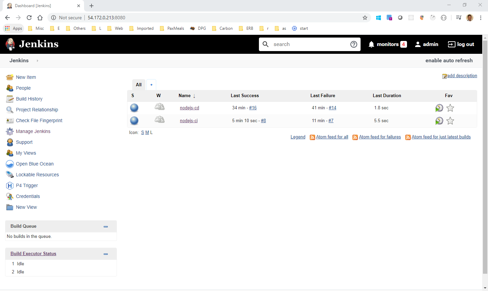
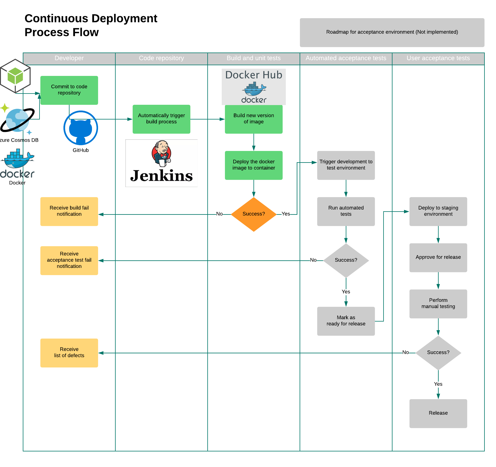

# Flight Schedule Services
This code repository contains the prototype for Quantum Airline’s to get the flight schedules built on state of art technologies as listed below:
1. Node.js - An API built to initiate the flight update to Flights data DB as per https://openflights.org/data.html
2. Cosmos - Globally-distributed DB to which support scalability as the need grows
3. Docker - package the code as image deploy as required
4. AWS EC2 - Virtual Cloud computing environment to host Jenkins 
5. Jenkins - Automation server which has 2 pipelines
    * Continous Integration - CI Pipeline which listens the comits on github, reads the secret keys from the server, creates docker image and pushes to Docker Hub
    * Continous Deployment - CD Pipeline to deploy the docker images as per the required environment

    
6. Docker Hub - Docker Image repository of the packaged code

Below is the pipeline flow of the application:

## About the project
The project expose an API, on request fetches the flight data from file and uploades to cosmos db.

DB keys are mainted in the .env file for local development, secret keys in jenkins server

The logs are available from AWS EC2 server as docker logs

The CI/CD pipleline groovy scripts under pipleline folder

The application is deployed on AWS EC2 server

## Assumptions
1. The data to be processed is available as a file

**Version 1.0.0**
---
## License & copyright
